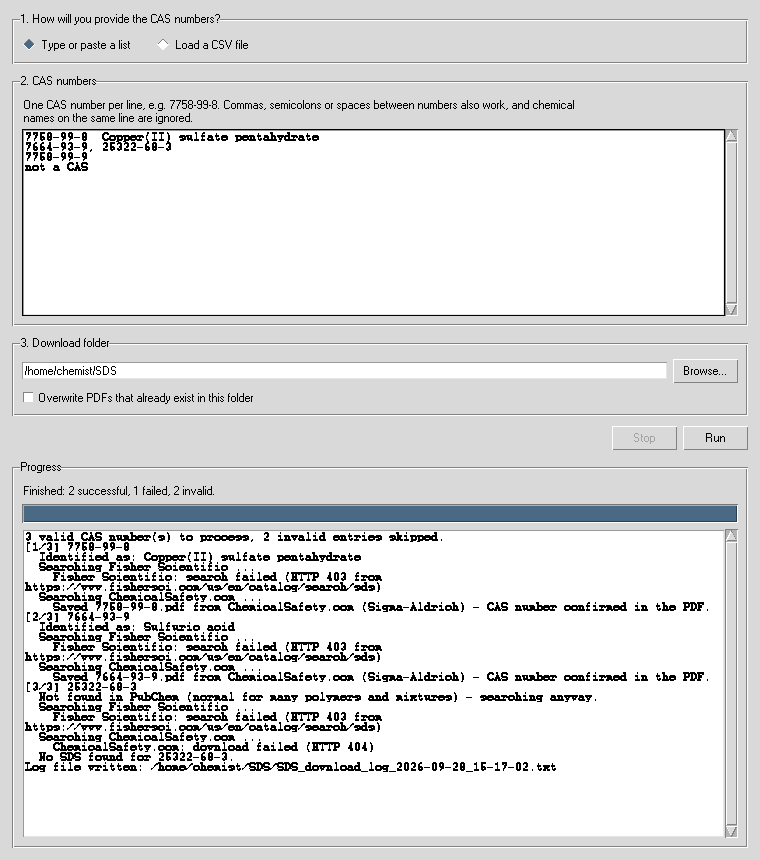

# SDS Fetch

A small desktop program that downloads Safety Data Sheet (SDS) PDFs for a list of chemicals, identified by CAS Registry Number. Each file is saved as `<CAS Number>.pdf` (for example `7758-99-8.pdf`) in a folder you choose. At the end, the program writes a log file in that folder that lists every CAS number as **successful**, **failed** or **invalid**.



*Screenshot from a simulated run with offline test data.*

## Installation

You need Python 3.9 or newer.

1. **Install Python** from <https://www.python.org/downloads/>. On Windows, tick **"Add python.exe to PATH"** in the installer and keep the **"tcl/tk and IDLE"** option ticked; the program window is built with Tk.
2. **Download this project**: on GitHub click **Code → Download ZIP** and unzip it, or run `git clone https://github.com/quenched-exciton/SDS-Fetch.git`.
3. **Install the three helper packages** (requests, beautifulsoup4, pypdf). Open a terminal (Windows: *Command Prompt*) in the project folder and run:

   ```
   python -m pip install -r requirements.txt
   ```

   On Windows, use `py` if `python` is not found: `py -m pip install -r requirements.txt`.

## Running the program

From the project folder:

```
python run_sds_fetch.py
```

`python -m sds_fetch` does the same thing.

## Using the window

1. **Choose the input method.** *Type or paste a list* shows a multi-line text box. *Load a CSV file* shows a file picker instead.
2. **Enter the CAS numbers.**
   * **Text box:** put one CAS number per line. Commas, semicolons, tabs or spaces between several numbers on one line also work. Anything else on the line is ignored, so you can paste two columns from Excel (for example `7758-99-8  Copper(II) sulfate pentahydrate`).
   * **CSV file:** the program uses the column whose header contains "CAS" (such as `CAS`, `CAS No.` or `CAS Number`). If no header contains "CAS", it uses the first column. Comma-, semicolon- and tab-separated files all work. See [`examples/example_cas_list.csv`](examples/example_cas_list.csv).
3. **Choose the download folder.** Tick *Overwrite PDFs that already exist* if you want to replace SDS files you downloaded before. Otherwise the program skips them.
4. **Press Run.** The progress panel at the bottom shows what the program is doing for each chemical. **Stop** finishes the current chemical and then stops; the log lists the unprocessed CAS numbers.

When the run is finished, a message shows the totals and offers to open the download folder.

## What you get

* `<CAS>.pdf` for every chemical with an SDS, e.g. `7664-93-9.pdf`.
* `SDS_download_log_<date>_<time>.txt` with these sections:
  * **SUCCESSFUL:** CAS number, file name, chemical name from PubChem, the website it came from, the supplier, and whether the CAS number was found in the PDF text.
  * **FAILED:** valid CAS numbers without an SDS, plus the result from each website (e.g. `HTTP 403`, `no SDS found`). This tells you whether a site blocked the request or simply doesn't have the chemical.
  * **INVALID:** entries that are not CAS numbers or that fail the CAS check digit (usually a typo).

## How it works

1. **Validation (offline).** Every CAS number includes a check digit. The program removes the check digit, reads the remaining digits from right to left, multiplies them by 1, 2, 3, … and adds the products. The last digit of that sum must equal the check digit. Water, 7732-18-5: 8×1 + 1×2 + 2×3 + 3×4 + 7×5 + 7×6 = 105 → check digit 5 ✔. Entries that fail go to the INVALID list and are never searched.
2. **Chemical identity.** [PubChem PUG-REST](https://pubchem.ncbi.nlm.nih.gov/docs/pug-rest) returns the name for each CAS number, which appears in the progress panel and in the log. Polymers, mixtures and some industrial products are often missing from PubChem. For those, the SDS search still runs.
3. **SDS search.** The program tries these websites in order and stops at the first good result:

   | Order | Website | How it searches |
   |---|---|---|
   | 1 | Fisher Scientific | SDS search page |
   | 2 | ChemicalSafety.com | free SDS database with sheets from many manufacturers (Sigma-Aldrich, Fisher, VWR, …) |
   | 3 | VWR / Avantor | SDS search page |
   | 4 | Fluorochem | product search service |
   | 5 | ChemBlink | one SDS page per CAS number |

4. **Checks before saving.** Each downloaded file must really be a PDF, and the program reads the first pages to confirm that the CAS number is printed in it. If the PDF names a different chemical, the program rejects it and tries the next link. If the PDF has no readable text (for example a scanned image), the program keeps it only when the website itself listed it under that exact CAS number. The log then marks it `NO - check manually`.

## Important limitations

* **Supplier websites change and some block automated downloads.** A website that is redesigned or starts refusing requests turns into `HTTP 403`, `no SDS found` or `search failed` messages in the log. The program then moves on to the next source. The website-reading code has automated tests against sample pages only, so a live website can behave differently. See *When a source stops working* below.
* **Use the SDS for the product you actually bought.** An SDS downloaded by CAS number may come from a different supplier than your product. Grade, composition, hazard classification and revision date can differ. OSHA HazCom (29 CFR 1910.1200) and REACH require the SDS that ships with your purchased product, so treat these downloads as a reference.
* **Check the supplier's terms of use.** Some websites restrict automated access. The program waits one second between chemicals and sends one request at a time, so keep your lists to a reasonable size.

## When a source stops working

Each website has its own function in [`sds_fetch/sources.py`](sds_fetch/sources.py). The list at the bottom of that file sets the search order:

```python
SDS_SOURCES = [
    ("Fisher Scientific", find_on_fisher),
    ("ChemicalSafety.com", find_on_chemicalsafety),
    ...
]
```

Move a line up or down to change the order, or put `#` in front of a line to switch that source off. Timeouts and the number of links tried per website are set at the top of the same file.

## Project layout

```
run_sds_fetch.py             start the program
sds_fetch/
    cas.py                   read the typed list / CSV, check CAS numbers
    sources.py               PubChem name lookup + one search function per SDS website
    downloader.py            download, verify, save <CAS>.pdf, write the log
    gui.py                   the window (Tkinter)
examples/example_cas_list.csv
tests/                       automated tests (no internet needed)
```

## Running the tests

```
python -m pip install -r requirements-dev.txt
python -m pytest
```

The tests use fake websites and generated PDFs, so they run offline in about a second. GitHub runs them automatically on every push (see `.github/workflows/tests.yml`).

## Acknowledgements

The open-source project [find_sds](https://github.com/khoivan88/find_sds) by Khoi Van showed which supplier websites offer SDS search by CAS number. This program is a separate implementation.

## License

MIT. See [LICENSE](LICENSE).
